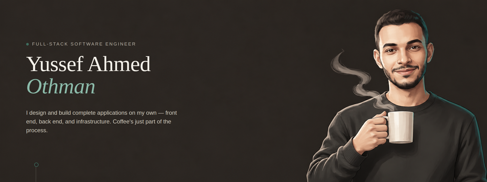
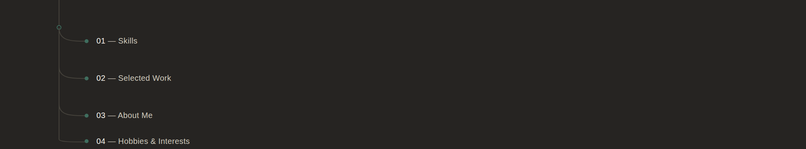
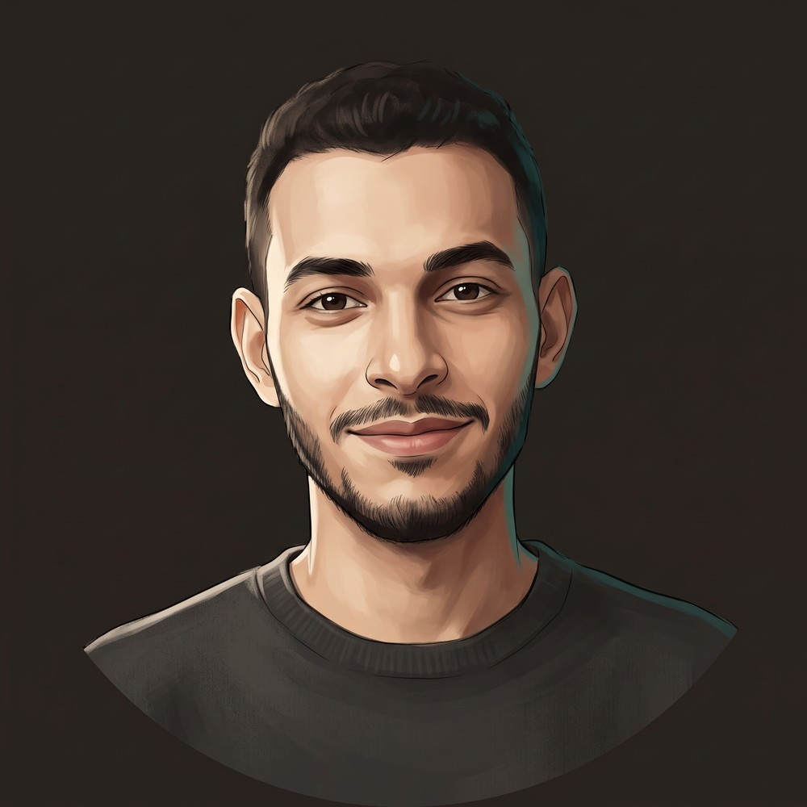

MANSOURA, EGYPT

I design and build complete applications on my own — front end, back end, and infrastructure — across web, mobile, desktop, and, occasionally, hardware. I'm not tied to one stack; I pick up whatever a project calls for.

---

### *01 — Skills*

<i>With great power comes great responsibility.</i>

**Front-End**
 
      

**Back-End & Data**
 
       

**DevOps & Tooling**
 
  

**AI & Tools**
 
  

---

### *02 — Selected Work*

- **Arena20** — Full-stack ERP & POS system with real-time multi-terminal sync and an offline-first data layer.
- **GOATs** — Bilingual sports-facility booking app with staff QR check-in and a loyalty wallet.
- **GOATs WhatsApp Bridge Server** — Containerized microservice for WhatsApp OTP and notifications.
- **Pedal Express** — Bicycle courier app, taken from Figma to production, with live map tracking.
- **Time & Room Billing System** — Bilingual desktop billing app for hourly room rentals.
- **Biometric Analysis Hardware Prototype** — Embedded hardware for biometric analysis, built from scratch.

More detail on each project is on the [portfolio site](https://uosf19.github.io).

---

### *03 — About Me*

<table>
<tr>
<td width="180">

</td>
<td>
Hello! My name is <b>Yussef</b>, and I'm a <b>Full-Stack Software Engineer</b> with a Computer Science background. I like taking a project from a blank page to something people actually use — the interface, the backend holding it together, and every small decision in between. I'm not tied to one stack; I pick up whatever a project calls for and get comfortable with it fast. Currently building across <b>React, TypeScript, Flutter, Node.js, and Supabase</b>, with a growing interest in bridging software with hardware through embedded systems.
</td>
</tr>
</table>

---

### *04 — Hobbies & Interests*

Hey. I'm the one who knocks. Well, most days I'm just the one who ships. Outside of code, you'll usually find me waiting for the right second to cut someone's signal, then closing the day out with something I've already watched enough times to quote from memory. Once I'm locked in, I'll dive into something for hours because I actually enjoy taking it apart until it makes sense — and I can't move on until it's actually finished. Call it perfectionism, I don't care. Most of what I know came the same way: I found something I didn't understand and refused to stop until I did. After all this time? Still the same.
